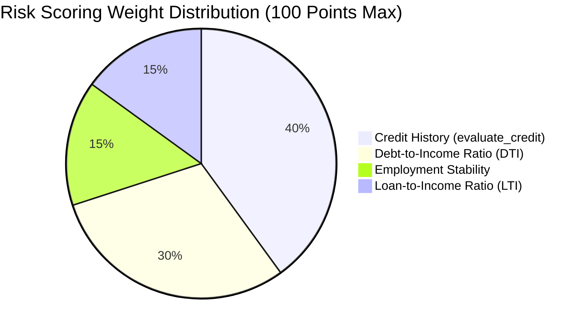

# 💳 Loan Approval & Risk Underwriting Engine

[](https://www.python.org/)
[](LICENSE)
[](#)

A rule-based automated financial underwriting and credit assessment engine written in Python. It models credit risk scoring, debt-to-income (DTI) analysis, loan-to-income (LTI) leverage, hard regulatory redlines, and tiered APR interest rate decisions.

---

## 🌟 How the Underwriting Engine Works

The engine scores applicants on a **100-Point Comprehensive Risk Matrix**:



### 1. Risk Matrix Breakdown

| Factor | Weight | Evaluation Criteria |
| :--- | :--- | :--- |
| **Credit Tier** | **40 pts** | • $\ge 750$: 40 pts (Excellent)<br>• $670 - 749$: 30 pts (Good)<br>• $580 - 669$: 15 pts (Fair)<br>• $< 580$: 0 pts (Poor) |
| **Debt-to-Income (DTI)** | **30 pts** | • $< 25\%$: 30 pts<br>• $25\% - 35.9\%$: 20 pts<br>• $36\% - 49.9\%$: 10 pts<br>• $\ge 50\%$: 0 pts |
| **Employment Stability** | **15 pts** | • $\ge 5\text{ yrs}$: 15 pts<br>• $2 - 4.9\text{ yrs}$: 10 pts<br>• $1 - 1.9\text{ yrs}$: 5 pts<br>• $< 1\text{ yr}$: 0 pts |
| **Loan-to-Income (LTI)** | **15 pts** | • $\le 20\%$: 15 pts<br>• $20.1\% - 40\%$: 10 pts<br>• $> 40\%$: 0 pts |

---

### 2. Hard Redlines (Immediate Disqualification)
Even with a high overall score, the engine enforces strict institutional risk guardrails:
- **Credit Score $< 500$** $\rightarrow$ **Automated Rejection**
- **DTI Ratio $> 60.0\%$** $\rightarrow$ **Automated Rejection**

---

### 3. Tiered Underwriting Verdicts

| Total Score | Decision | Term / APR Offered |
| :--- | :--- | :--- |
| **$\ge 80$ pts** | **APPROVED** | **Tier 1 (Preferred Rate): 4.5% APR** |
| **$60 - 79$ pts** | **APPROVED** | **Tier 2 (Standard Rate): 8.5% APR** |
| **$45 - 59$ pts** | **CONDITIONAL** | **Requires a Qualified Co-Signer** |
| **$< 45$ pts** | **REJECTED** | **Risk score below lending threshold** |

---

## 💻 Quickstart & Usage

```bash
# Clone the repository
git clone https://github.com/inoy-252/loan-approval-predictor.git
cd loan-approval-predictor

# Run the underwriting engine
python app.py
```

### 💡 Example Evaluation Output:

```text
=============================================
Total Score: 75
DTI: 19.2
Credit Tier: good
Auto-Rejected: False
FINAL VERDICT: APPROVED (Tier 2: Standard Rate - 8.5% APR)
=============================================
```

---

## 📂 File Structure

```text
loan-approval-predictor/
├── app.py         # Underwriting engine & decision logic
├── .gitignore     # Standard Python ignore rules
└── README.md      # Financial documentation & matrix breakdown
```

---

## 🔮 Roadmap / Future Enhancements

- [ ] Interactive CLI prompt for real-time applicant data entry.
- [ ] Integration with a machine learning classification model (Logistic Regression / XGBoost).
- [ ] Amortization schedule calculator with monthly payment breakdowns.

---

## 👤 Author

**Yasir Lone ([@inoy-252](https://github.com/inoy-252))**
